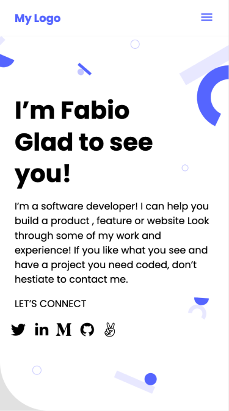

# Portfolio Microverse

> Portfolio project, the goal is to start working on it from the beginning of the Microverse program and precisely replicate one of the portfolio templates provided.

## Built With

- Languages: HTML and CSS
- Frameworks: None
- Technologies: Git, GitHub and VSCode

## Live Demo

[fbclh.me](http://www.fbclh.me/)

## Getting Started

To get a local copy up and running follow there simple steps:

- You can clone this repo by typing `git clone` git@github.com:fbclh/portfolio-microverse.git on you terminal.
- Type `cd` portfolio-microverse to access the project on the terminal

## Authors

- GitHub: [@fbclh](https://github.com/fbclh)
- LinkedIn: [@fbclh](https://www.linkedin.com/in/fbclh)

## Contributing

Contributions, issues, and feature requests are welcome!

Feel free to check the [issues page](../../issues/).

## Show your support

Give a star if you like this project!

## Acknowledgments

- Hat tip to anyone whose code was used
- Inspiration
- etc

## License

This project is [MIT](./MIT.md) licensed.
